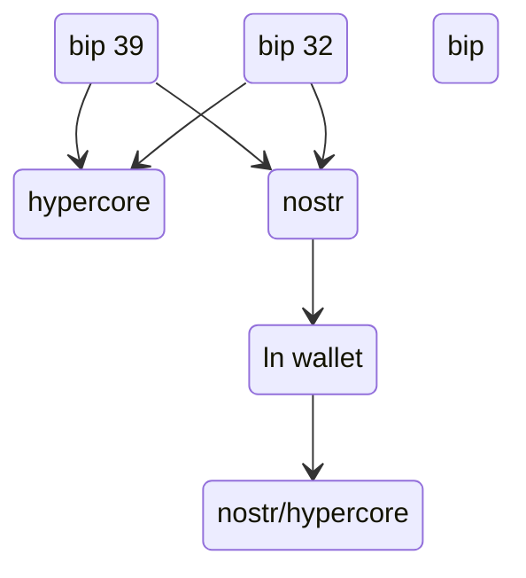

# FireBolt

App wallet for Android  and iOs with Nostr, HyperCore, Nostr and Lightning Network 

  <a href="https://github.com/AreaLayer/FireBolt" title="AreaLayer">
    </img>
  </a>

<h3 align="center">FireBolt</h3>

---

**⚠️ Alpha software may put your money at risk.**

**⚠️ We recommend using only small amounts.**

 Android - Download latest APK (Soon)

iPhone - Download latest TestFlight app (Soon)

---

# Feature

- Lightning Network

- Nostr

- Bitcoin

- HyperCore (TBA)

- No shitcoins or stablecoins

# Diagram

# Product

Built on BDK, LDK, HyperCore and Nostr
